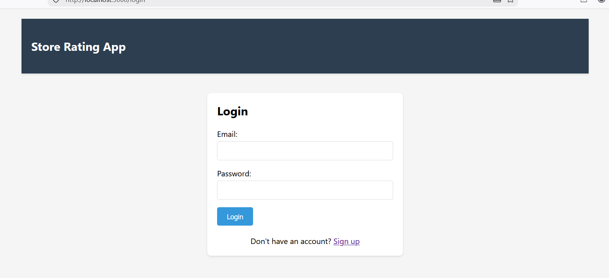
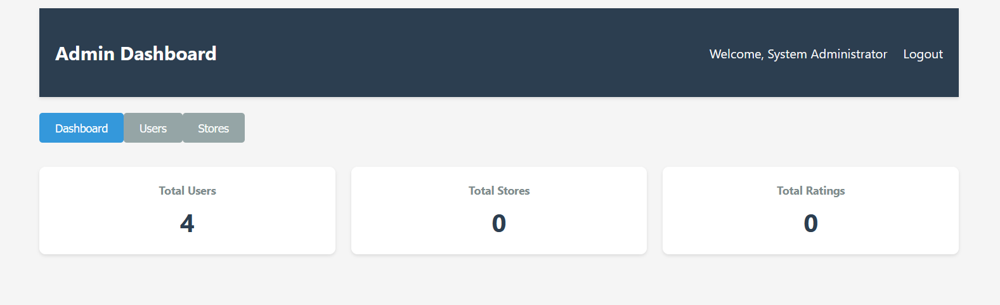
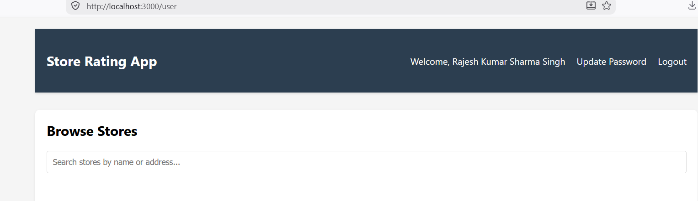

# Store Rating Application

A full-stack web application for store rating management with role-based access control.

## Application Screenshots

### Login Page

*User authentication interface with email and password fields*

### Admin Dashboard

*Admin interface showing statistics, user management, and store management*

### User Dashboard - Store Browsing

*Store listing with search functionality and rating options*

### Store Owner Dashboard
Store owner interface showing ratings and user feedback*

## Tech Stack

- **Backend**: Express.js
- **Database**: MySQL
- **Frontend**: React.js
- **Authentication**: JWT (JSON Web Tokens)

## Features

### User Roles
1. **System Administrator**
   - Add new users and stores
   - View dashboard with statistics
   - Manage users and stores with filtering and sorting
   - View detailed user and store information

2. **Normal User**
   - Sign up and login
   - Browse and search stores
   - Submit and modify ratings (1-5 stars)
   - Update password

3. **Store Owner**
   - View store dashboard
   - See average rating and total ratings
   - View list of users who rated their store
   - Update password

## Setup Instructions

### Prerequisites
- Node.js (v14 or higher)
- MySQL Server
- npm or yarn

### Database Setup

1. Create a MySQL database:
```sql
CREATE DATABASE store_rating_app;
```

2. Run the schema file:
```bash
mysql -u root -p store_rating_app < database/schema.sql
```

3. Update database credentials in `backend/.env`:
```
DB_HOST=localhost
DB_USER=root
DB_PASSWORD=your_password
DB_NAME=store_rating_app
```

### Backend Setup

1. Navigate to backend directory:
```bash
cd backend
```

2. Install dependencies:
```bash
npm install
```

3. Configure environment variables in `.env`:
```
PORT=5000
DB_HOST=localhost
DB_USER=root
DB_PASSWORD=your_password
DB_NAME=store_rating_app
JWT_SECRET=your_jwt_secret_key_change_this_in_production
```

4. Start the backend server:
```bash
npm run dev
```

The backend will run on `http://localhost:5000`

### Frontend Setup

1. Navigate to frontend directory:
```bash
cd frontend
```

2. Install dependencies:
```bash
npm install
```

3. Start the React development server:
```bash
npm start
```

The frontend will run on `http://localhost:3000`

## Default Admin User

- **Email**: admin@storeapp.com
- **Password**: Admin@123

*Note: You should change the default admin password after first login.*

## Form Validations

- **Name**: 20-60 characters
- **Email**: Standard email format
- **Password**: 8-16 characters, at least one uppercase letter and one special character
- **Address**: Maximum 400 characters

## API Endpoints

### Authentication
- `POST /api/auth/signup` - User registration
- `POST /api/auth/login` - User login
- `PUT /api/auth/password` - Update password

### Admin
- `GET /api/admin/dashboard` - Get dashboard statistics
- `POST /api/admin/users` - Add new user
- `GET /api/admin/users` - Get all users with filters
- `GET /api/admin/users/:id` - Get user details
- `POST /api/admin/stores` - Add new store
- `GET /api/admin/stores` - Get all stores with filters

### User
- `GET /api/users/profile` - Get user profile
- `PUT /api/users/password` - Update password

### Stores
- `GET /api/stores` - Get all stores with search
- `GET /api/stores/:id` - Get single store details

### Ratings
- `POST /api/ratings` - Submit/update rating
- `GET /api/ratings/owner/dashboard` - Get store owner dashboard
- `GET /api/ratings/my-ratings` - Get user's ratings

## Project Structure

```
store-rating-app/
├── backend/
│   ├── config/
│   │   └── database.js
│   ├── middleware/
│   │   ├── auth.js
│   │   └── validation.js
│   ├── routes/
│   │   ├── admin.js
│   │   ├── auth.js
│   │   ├── ratings.js
│   │   ├── stores.js
│   │   └── users.js
│   ├── .env
│   ├── package.json
│   └── server.js
├── frontend/
│   ├── public/
│   │   └── index.html
│   ├── src/
│   │   ├── components/
│   │   │   ├── AdminDashboard.js
│   │   │   ├── Login.js
│   │   │   ├── Signup.js
│   │   │   ├── StoreOwnerDashboard.js
│   │   │   └── UserDashboard.js
│   │   ├── utils/
│   │   │   └── api.js
│   │   ├── App.js
│   │   ├── index.css
│   │   └── index.js
│   ├── package.json
│   └── public/
└── database/
    └── schema.sql
```

## Features Implemented

### ✅ Authentication & Authorization
- JWT-based authentication
- Role-based access control
- Protected routes

### ✅ Admin Features
- Dashboard with statistics
- User management (add, view, filter, sort)
- Store management (add, view, filter, sort)
- Detailed user and store views

### ✅ Normal User Features
- Store browsing with search
- Rating submission (1-5 stars)
- Rating modification
- Password update

### ✅ Store Owner Features
- Store dashboard
- Average rating display
- User ratings list
- Password update

### ✅ Form Validations
- Client-side validation
- Server-side validation
- Custom validation rules

### ✅ UI/UX Features
- Responsive design
- Sorting functionality
- Search/filter functionality
- Star rating display
- Error handling
- Loading states

## Testing

1. **Admin Testing**:
   - Login with admin credentials
   - Add new users (normal user and store owner)
   - Add new stores
   - View dashboard statistics
   - Filter and sort users/stores

2. **Normal User Testing**:
   - Sign up as new user
   - Browse stores
   - Search stores
   - Submit ratings
   - Modify ratings
   - Update password

3. **Store Owner Testing**:
   - Login as store owner
   - View store dashboard
   - Check average rating
   - View user ratings
   - Update password

## Security Notes

- Change the default JWT_SECRET in production
- Use environment variables for sensitive data
- Implement HTTPS in production
- Add rate limiting for API endpoints
- Implement CSRF protection
- Add input sanitization for production

## Future Enhancements

- Email notifications
- Password reset functionality
- Store images
- Advanced analytics
- Export functionality
- Multi-language support
- Mobile app

## Adding Screenshots

To add screenshots to the README:

1. Create an `images` directory in the project root:
```bash
mkdir images
```

2. Add the following screenshots:
   - `login.png` - Login page screenshot
   - `admin-dashboard.png` - Admin dashboard screenshot
   - `user-dashboard.png` - User store browsing screenshot
   - `store-owner-dashboard.png` - Store owner dashboard screenshot
   - `architecture.png` - System architecture diagram

3. Take screenshots of the application at 1200x800 resolution for best quality

4. Place images in the `images/` directory and they will automatically appear in the README

